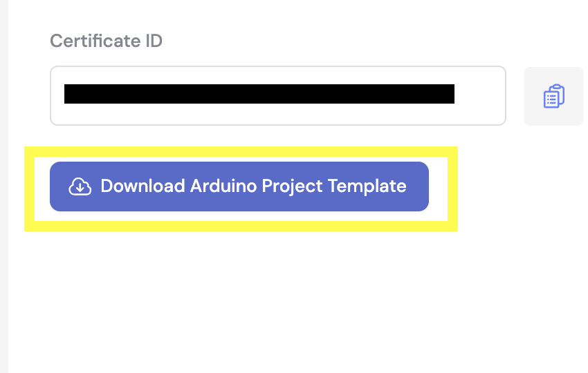

# golain-iot-sdk
C++ SDK for Golain IoT Platform based on the Arduino framework.
- Minimal setup to get up and running with Golain.
- Support for Wi-Fi, GSM, 4G, LTE, LoRaWAN, NB-IoT via TinyGSM for communication.
- Post Device Data, update Device Shadow, receive OTA Updates, monitor device logs, and more.

## Features
| Feature          | Status             |
|------------------|--------------------|
| Device Shadow    | :heavy_check_mark: |
| Device Logs      | :heavy_check_mark: |
| Device Data      | :heavy_check_mark: |
| User Association | :heavy_check_mark: |
| OTA              | :heavy_check_mark: |
| BLE              | `alpha`            |
| Embedded RPC     | :x:                |


## Works with / Continuous Testing done on -
| Hardware               | Status   | Tested             |
|------------------------|----------|--------------------|
| ESP32-WROOM32-D        | `stable` | :heavy_check_mark: |
| ESP32-C3               | `stable` | :heavy_check_mark: |
| ESP32-S3               | `stable` | :heavy_check_mark: |
| ESP32-C6               | `stable` | :heavy_check_mark: |
| nRF52840-DK + SIM7600E | `dev`    | :heavy_check_mark: |
| nRF52832-DK + SIM800L  | `dev`    | :heavy_check_mark: |
| nRF9160                | `dev`    | :heavy_check_mark: |

See Example Projects for more details.
# Getting Started


### Prerequisites - 
1. VS Code - 
    Download and install VS Code from [here](https://code.visualstudio.com/download).
2. PlatformIO's extension for VS Code - Install the PlatformIO extension for VS Code from [here](https://platformio.org/install/ide?install=vscode).
3. ProtoCompiler - 
    `protoc` is required for golain sdks to work and should be available in your `PATH`.
    - Windows - Download and install from [here]()
    - Linux - 
        - Debian/Ubuntu -
        ```bash
        sudo apt install protobuf-compiler
        ```
        - Fedora -
        ```bash
        sudo dnf install protobuf-compiler
        ```
        - Arch -
        ```bash
        sudo pacman -S protobuf
        ```
    - MacOS - 
        - via Homebrew
        ```bash
        brew install protobuf
        ```
        - via MacPorts
        ```bash
        sudo port install protobuf3-cpp
        ```

## Setup 

1. Create a new PlatformIO project
    - Open VS Code and click on the PlatformIO icon on the left sidebar.
    - Click on `New Project` and select your board.
    - Select a project name and click on `Finish`.


2. Add these lines in platformio.ini

   ```ini
   [env:esp32dev]
   board = esp32dev
   framework = arduino
   monitor_speed = 115200
   build_flags = -D "MBEDTLS_KEY_EXCHANGE__SOME__PSK_ENABLED"
      -D ROOT_TOPIC='"/ca5c_3c15/"' // single 
      -D DEVICE_NAME='"Device 002"'
   lib_deps = 
      idaga/golain-platformio-sdk@^0.2
   custom_nanopb_protos =
      +<src/*.proto>
   custom_nanopb_options = 
      --error-on-unmatched

   
3. Update metadata
    - Update the `ROOT_TOPIC` in this format: `'"/xxxx/"'` (replace xxxx with your topic)
    - Update the `DEVICE_NAME` in this format: `'"xxxx"'`  (replace xxxx with your device name)
   

4. Get device credentials from [Golain Console](https://web.golain.io) - 
    - Login to Golain Console and navigate to `Devices` section.
    - Click on `Add Device` and follow the instructions.
    - Download the PlatformIO `certs.h` file and place it in your project's `include` folder.
    - Also download the `project template` and place its contents in the src folder.

    


5. Go to the `main.cpp` and replace it with the content which you got in `main.ino` file while downloading headers.


6. From the quick access of PIO Home
   - Go to libraries and install the following dependencies `golain-platformio-sdk`.
   

7. Make sure your ESP32 board appears on the on your `Serial Port` from the `device` section from PIO Home.


8. Once all dependencies and files are placed and modified, build the program. Your build will be flashed on to the Board.


9. If everything is done correctly, you should be able to see your device online on your [Golain Console](https://web.golain.io).